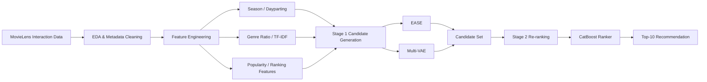

<div align="center">

# Movie Recommendation

정적 선호와 시퀀셜 패턴을 함께 반영한 2단계 영화 추천 시스템 프로젝트

</div>

> 네이버 부스트캠프에서 진행한 추천 시스템 프로젝트입니다.

## 1. Introduction

### 1.1. MovieLens 기반 영화 추천 시스템

이 프로젝트는 MovieLens 데이터를 활용해 사용자의 시청 이력과 타임스탬프를 기반으로 다음에 볼 영화와 선호 영화 후보를 예측하는 추천 시스템 프로젝트입니다.

단순한 정적 선호 예측을 넘어, 시청 순서와 중간 누락 아이템까지 함께 고려해야 하는 문제를 다루기 때문에 정적 취향과 순차적 패턴을 동시에 반영할 수 있는 구조가 필요했습니다. 그래서 후보군 생성과 리랭킹을 분리한 2단계 추천 구조를 중심으로 실험을 진행했습니다.

### 1.2. Project Objective

- MovieLens 기반 Top-K 추천 성능 향상
- 정적 선호와 순차적 패턴을 함께 반영할 수 있는 추천 구조 설계
- 메타데이터 정제와 Feature Engineering을 통한 추천 품질 개선
- 후보군 생성과 리랭킹이 분리된 추천 파이프라인 구축

### 1.3. 주요 접근

| 항목 | 설명 |
|------|------|
| 데이터 특성 | 암시적 피드백 기반 추천, 마지막 아이템 예측과 누락 아이템 복원 모두 고려 |
| 핵심 피처 | season, dayparting, 장르 비율, 영화 인기도, 랭킹, 감독/작가 정제 |
| 후보 생성 | EASE + Multi-VAE |
| 리랭킹 | CatBoost Ranker 기반 2-Stage Re-ranking |

## 2. Recommendation Pipeline

### 2.1. 2-Stage 추천 구조



### 2.2. Modeling Strategy

- `S3Rec`, `EASE`, `Multi-VAE`, `CatBoost Ranker`, Transformer Encoder 기반 모델을 비교했습니다.
- 계절별 시청 패턴과 시간대 선호를 반영하기 위해 `season`, `dayparting` 피처를 설계했습니다.
- 유저 과거 시청 장르 비율, 영화 인기도, 랭킹 피처를 추가했습니다.
- 감독과 작가의 1:N 관계를 대표 인물 정보로 정제해 차원을 줄였습니다.
- 장르 TF-IDF를 적용해 흔한 장르의 영향력을 낮추고 희귀 취향 신호를 강화했습니다.

## 3. Result

### 3.1. 성능 요약

| 모델 | Public LB |
|------|-----------|
| S3Rec | 0.0559 |
| EASE (Base) | 0.1572 |
| EASE (Optuna Tuned) | 0.1599 |
| EASE + Multi-VAE | 0.1620 |
| 2-Stage (CatBoost Final) | 0.1670 |

### 3.2. 결과 요약

- 최종 아키텍처는 `2-Stage Re-ranking System`입니다.
- Stage 1에서 유저당 200개의 후보군을 생성하고, Stage 2에서 약 40개의 피처를 활용해 최종 Top-10을 선정했습니다.
- `Valid Recall@10 0.2012`, `Public LB 0.1670`으로 프로젝트 최고 성능을 달성했습니다.

## 4. Project Structure

```text
pro-recsys-movierecommendation-recsys-06
├─ config/              # 모델별 실행 설정
├─ docs/                # 아키텍처, 설정, 실행 가이드
├─ src/                 # 공통 추천 프레임워크
├─ experiments/         # 실험용 확장 코드와 보조 실행 흐름
├─ main.py              # 실행 진입점
└─ README.md
```

### 4.1. 내부 구성

- `src/problems/`: 문제 정의 및 제출 규칙
- `src/data/`: loader, pipeline, transform
- `src/engines/`: torch, sklearn, recbole 엔진
- `src/models/`: 모델별 recipe 및 구현
- `src/bootstrap.py`: 레지스트리 등록 진입점

## 5. Tech Stack

- `Python`
- `PyTorch`
- `RecBole`
- `Scikit-learn`
- `CatBoost`
- `Pandas`
- `YAML`

## 6. Run

### 6.1. 설치

```bash
python3 -m pip install -r requirements.txt
```

### 6.2. RecBole 기반 실행 예시

```bash
python3 main.py --config config/recbole_LGCN.yaml
```

### 6.3. Torch 기반 실행 예시

```bash
python3 main.py --config config/torch_S3Rec_seqtopn.yaml
```

### 6.4. 예측

```bash
python3 main.py --config config/torch_S3Rec_seqtopn.yaml --mode predict --checkpoint <ckpt_path>
```

## 7. Team

| 이름 | 역할 |
|------|------|
| 김태형 | 프레임워크 개발 및 유지 보수 |
| 김민재 | 메타데이터 EDA, 2-Stage 리랭킹 시스템 설계 |
| 석찬휘 | DL 모델 설계 및 실험 |
| 조형동 | DL 모델 설계 및 실험, EASE+BERT 앙상블 구현 |
| 최영진 | EDA, Feature Engineering, 모델 구현 및 테스트 |
